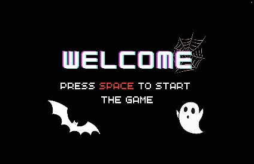

<p align="center">
<h1 align="center">Shooter Game Showcase</h1>

</p>

<p align="center">
  
</p>

<p align="center">
  <a href="LICENSE"></a>
  <a href="https://en.cppreference.com/w/cpp/17"></a>
  <a href="https://cmake.org/"></a>
  <a href="https://conan.io/"></a>
  <a href="https://www.opengl.org/"></a>
  <a href="https://www.libsdl.org/"></a>
</p>


Explore a fully playable FPS-style game built with the `asr` renderer in C++. This game demonstrates the power and flexibility of the framework by implementing a classic first-person shooter experience featuring:

- **Player movement** using the keyboard (WASD or arrow keys).
- **Textured and shaded environment** including walls, floors, and ceilings.
- **Dynamic enemies** that spawn continuously and actively chase the player.
- **Mouse-controlled camera** allowing free looking around.
- **Shooting mechanics** with mouse clicks to eliminate enemies.
- **Gameplay progression** until the player is killed by enemies.
- **On-screen score display** implemented independently due to lack of native text rendering support.

The project is based on the file `game_test.cpp`. It demonstrates how to extend and customize `asr` by:

- Adding new game logic and player controls.
- Enhancing the engine with delta time (`dt`) access for smooth animations.
- Implementing object lifecycle management (removal from the scene graph).
- Adding custom assets to the `data` directory.

The game window is created using the recommended code snippet below to ensure compatibility with graders and screenshot tools:

```cpp
auto window = std::make_shared<ES2SDLWindow>("asr 2.0", 1280, 720);
```

This showcase highlights how you can build a rich, interactive experience on top of the lightweight and extensible `asr` rendering framework.

---
# asr

`asr` is a simple renderer written in C++ designed for creative coding and data visualization.

## Supported Platforms

* Windows 10, 11
* macOS Sonoma, Sequoia
* Ubuntu 22.04, 24.04

## Prerequisites

Ensure all the prerequisites are installed before proceeding.

* MSVC (with Visual Studio 2022), Clang (with the latest Xcode or Command Line Tools for Xcode), or GCC (any version with support for C++17)
* CMake (version 3.25 or higher)
* Conan (version 2 or higher)
* CLion (version 2024 or higher) with the latest Conan plugin
* GPU drivers (latest version with stable support for OpenGL 2 or ES 2.0)

## Building

1. Ensure the Conan packgage manager has at least the default compiler profile:

   ```
   conan profile detect --force
   ```

2. Install dependencies using Conan for `Release` and `Debug` configurations:

    ```bash
    conan install . --build missing
    conan install . --build missing --settings build_type=Debug
    ```

    On Ubuntu, additional system packages might be required. Follow the recommendations in the output from the previous command or rerun Conan with the following options to install the necessary packages automatically:

    ```bash
    sudo apt install pkg-config libopengl-dev
    conan install . --build missing --conf tools.system.package_manager:mode=install --conf tools.system.package_manager:sudo=True
    conan install . --build missing --conf tools.system.package_manager:mode=install --conf tools.system.package_manager:sudo=True --settings build_type=Debug
    ```

3. Generate build files:

    ```bash
    # On Windows
    cmake --preset conan-default

    # On macOS, GNU/Linux, or Windows with WSL
    cmake --preset conan-release # or `conan-debug` for a build with debugging information
    ```

4. Build the project:

    ```bash
    cmake --build --preset conan-release # or `conan-debug` for a build with debugging information
    ```

5. Run the test program from the `./build/Release/` directory:

    ```bash
    (cd ./build/Release && ./<name of the graphics test executable>) # Note the parentheses
    ```

    You may need to set the Working Directory (CWD) in your IDE manually for some test targets to locate shader or image files.

<p align="center">
  <i>Developed with ♥ by <a href="https://www.kobiljon.com">Kobiljon</a></i>
</p>
